# 📋 **DOCUMENTACIÓN - APIs de Recompensas Recientes**

## 🎯 **RESUMEN EJECUTIVO**

El sistema de recompensas recientes utiliza un **sistema de fallback robusto** que intenta obtener datos de dos endpoints diferentes para garantizar que siempre se muestren recompensas al usuario.

---

## 🔄 **FLUJO DE EJECUCIÓN**

```mermaid
graph TD
    A[Iniciar carga] --> B[Llamar API Estadísticas]
    B --> C{¿Éxito?}
    C -->|Sí| D{¿Hay datos?}
    C -->|No| E[Usar Fallback]
    D -->|Sí| F[Mostrar datos de estadísticas]
    D -->|No| E
    E --> G[Llamar API Lista]
    G --> H{¿Éxito?}
    H -->|Sí| I[Mostrar datos de lista]
    H -->|No| J[Mostrar mensaje vacío]
```



---

## 📡 **ENDPOINT 1: ESTADÍSTICAS (PRINCIPAL)**

### **URL:**
```
GET /api/admin/recompensas/estadisticas
```

### **Propósito:**
Obtener estadísticas generales y las recompensas más populares del mes.

### **Headers:**
```http
Content-Type: application/json
Authorization: Bearer {token}
Accept: application/json
```

### **Respuesta Exitosa (200):**
```json
{
  "success": true,
  "message": "Estadísticas obtenidas correctamente",
  "data": {
    "resumen": {
      "recompensas_activas": 15,
      "tasa_activacion": 85.5
    },
    "mes_actual": {
      "puntos_otorgados": 2500,
      "clientes_beneficiados": 120
    },
    "top_recompensas_mes": [
      {
        "id": 1,
        "nombre": "Descuento Black Friday",
        "tipo": "descuento",
        "clientes_unicos": 45,
        "aplicaciones_mes": 89
      },
      {
        "id": 2,
        "nombre": "Puntos Dobles",
        "tipo": "puntos",
        "clientes_unicos": 32,
        "aplicaciones_mes": 67
      }
    ],
    "por_tipo": {
      "puntos": {
        "total": 8,
        "activas": 6,
        "aplicaciones_mes": 156
      },
      "descuento": {
        "total": 5,
        "activas": 4,
        "aplicaciones_mes": 89
      }
    }
  }
}
```

### **Respuesta de Error (500):**
```json
{
  "success": false,
  "message": "Error interno del servidor",
  "error": "Database connection failed"
}
```

### **Respuesta de Error (404):**
```json
{
  "success": false,
  "message": "Endpoint no encontrado"
}
```

---

## 📡 **ENDPOINT 2: LISTA (FALLBACK)**

### **URL:**
```
GET /api/admin/recompensas?page=1&per_page=10&order_by=created_at&order_direction=desc
```

### **Propósito:**
Obtener las últimas recompensas creadas como alternativa cuando el endpoint de estadísticas falla.

### **Parámetros de Query:**
| Parámetro | Tipo | Requerido | Descripción |
|-----------|------|-----------|-------------|
| `page` | integer | No | Número de página (default: 1) |
| `per_page` | integer | No | Elementos por página (default: 10) |
| `order_by` | string | No | Campo de ordenamiento (default: 'created_at') |
| `order_direction` | string | No | Dirección: 'asc' o 'desc' (default: 'desc') |

### **Headers:**
```http
Content-Type: application/json
Authorization: Bearer {token}
Accept: application/json
```

### **Respuesta Exitosa (200):**
```json
{
  "success": true,
  "message": "Recompensas obtenidas correctamente",
  "data": {
    "data": [
      {
        "id": 1,
        "nombre": "Descuento Black Friday",
        "descripcion": "Descuento especial para Black Friday",
        "tipo": "descuento",
        "estado": "activa",
        "fecha_inicio": "2024-11-01",
        "fecha_fin": "2024-11-30",
        "total_clientes": 45,
        "total_productos": 12,
        "valor_total_recompensa": 1500.00,
        "created_at": "2024-10-15T10:30:00Z",
        "updated_at": "2024-10-15T10:30:00Z"
      },
      {
        "id": 2,
        "nombre": "Puntos Dobles",
        "descripcion": "Gana puntos dobles en todas tus compras",
        "tipo": "puntos",
        "estado": "activa",
        "fecha_inicio": "2024-11-01",
        "fecha_fin": "2024-12-31",
        "total_clientes": 32,
        "total_productos": 8,
        "valor_total_recompensa": 800.00,
        "created_at": "2024-10-10T14:20:00Z",
        "updated_at": "2024-10-10T14:20:00Z"
      }
    ],
    "current_page": 1,
    "last_page": 3,
    "per_page": 10,
    "total": 25
  }
}
```

### **Respuesta de Error (500):**
```json
{
  "success": false,
  "message": "Error interno del servidor",
  "error": "Database connection failed"
}
```

---

## 🔧 **IMPLEMENTACIÓN EN FRONTEND**

### **Código TypeScript:**
```typescript
// Método principal
cargarRecompensasRecientes(): void {
  console.log('🔄 Iniciando carga de recompensas recientes...');
  
  // Intento 1: Estadísticas
  this.recompensasService.obtenerEstadisticas().subscribe({
    next: (response) => {
      if (response.success && response.data.top_recompensas_mes) {
        // Mapear datos de estadísticas
        this.recompensasRecientes = response.data.top_recompensas_mes.map((recompensa: any) => ({
          id: recompensa.id,
          nombre: recompensa.nombre,
          tipo: recompensa.tipo,
          estado: 'activa',
          fecha_inicio: new Date().toISOString().split('T')[0],
          beneficiarios: recompensa.clientes_unicos || 0
        }));
      } else {
        // Fallback: usar lista
        this.cargarRecompensasRecientesFallback();
      }
    },
    error: (error) => {
      console.error('Error en estadísticas:', error);
      // Fallback: usar lista
      this.cargarRecompensasRecientesFallback();
    }
  });
}

// Método de fallback
cargarRecompensasRecientesFallback(): void {
  const filtros: FiltrosRecompensas = {
    page: 1,
    per_page: 10,
    order_by: 'created_at',
    order_direction: 'desc'
  };

  this.recompensasService.obtenerLista(filtros).subscribe({
    next: (response: any) => {
      if (response.success && response.data.data) {
        // Mapear datos de lista
        this.recompensasRecientes = response.data.data.map((recompensa: any) => ({
          id: recompensa.id,
          nombre: recompensa.nombre,
          tipo: recompensa.tipo,
          estado: recompensa.estado || this.getEstadoReal(recompensa),
          fecha_inicio: recompensa.fecha_inicio,
          beneficiarios: recompensa.total_clientes || 0
        }));
      } else {
        this.recompensasRecientes = [];
      }
    },
    error: (error) => {
      console.error('Error en fallback:', error);
      this.recompensasRecientes = [];
    }
  });
}
```

---

## 🐛 **DEBUGGING Y LOGS**

### **Logs de Consola:**
```typescript
// Logs principales
🔄 Iniciando carga de recompensas recientes...
📊 Respuesta de estadísticas: {success: true, data: {...}}
✅ Datos de estadísticas disponibles: [...]
✅ Recompensas recientes cargadas desde estadísticas: [...]

// Logs de fallback
⚠️ No hay datos de estadísticas, usando fallback...
🔄 Cargando recompensas recientes usando fallback...
📋 Filtros para fallback: {page: 1, per_page: 10, ...}
📊 Respuesta del fallback: {success: true, data: {...}}
✅ Datos encontrados en fallback: 5 recompensas
✅ Recompensas recientes cargadas desde fallback: 5

// Logs de error
❌ Error cargando recompensas recientes desde estadísticas: {...}
⚠️ Error 500 en estadísticas - Usando fallback para recompensas recientes
❌ Error en fallback de recompensas recientes: {...}
```

### **Botón de Debug:**
```html
<button class="btn btn-sm btn-outline-secondary" (click)="debugRecompensasRecientes()" title="Debug">
  <i class="fas fa-bug"></i>
</button>
```

---

## 🎯 **CASOS DE USO**

### **Caso 1: Todo funciona correctamente**
1. ✅ API de estadísticas responde con datos
2. ✅ Se muestran las recompensas más populares del mes
3. ✅ No se ejecuta el fallback

### **Caso 2: Estadísticas fallan, lista funciona**
1. ❌ API de estadísticas devuelve error 500
2. ✅ Se ejecuta automáticamente el fallback
3. ✅ Se muestran las últimas recompensas creadas

### **Caso 3: Ambas APIs fallan**
1. ❌ API de estadísticas devuelve error 500
2. ❌ API de lista también devuelve error 500
3. ❌ Se muestra mensaje "No hay recompensas recientes"

### **Caso 4: No hay datos en la base**
1. ✅ API de estadísticas responde correctamente
2. ❌ `top_recompensas_mes` está vacío
3. ✅ Se ejecuta fallback
4. ❌ Lista también está vacía
5. ❌ Se muestra mensaje "No hay recompensas recientes"

---

## 🔧 **CONFIGURACIÓN DEL SERVICIO**

### **URL Base:**
```typescript
private apiUrl = `${environment.apiUrl}/admin/recompensas`;
```

### **Métodos del Servicio:**
```typescript
// Estadísticas
obtenerEstadisticas(): Observable<ApiResponse<EstadisticasRecompensas>> {
  return this.http.get<ApiResponse<EstadisticasRecompensas>>(`${this.apiUrl}/estadisticas`);
}

// Lista con filtros
obtenerLista(filtros?: FiltrosRecompensas): Observable<PaginatedResponse<RecompensaLista>> {
  let params = new HttpParams();
  if (filtros) {
    Object.keys(filtros).forEach(key => {
      const value = filtros[key as keyof FiltrosRecompensas];
      if (value !== undefined && value !== null && value !== '') {
        params = params.set(key, value.toString());
      }
    });
  }
  return this.http.get<PaginatedResponse<RecompensaLista>>(this.apiUrl, { params });
}
```

---

## 📊 **INTERFACES DE DATOS**

### **RecompensaReciente:**
```typescript
interface RecompensaReciente {
  id: number;
  nombre: string;
  tipo: string;
  estado: string;
  fecha_inicio: string;
  beneficiarios: number;
}
```

### **FiltrosRecompensas:**
```typescript
interface FiltrosRecompensas {
  page?: number;
  per_page?: 10 | 15 | 25 | 50 | 100;
  order_by?: 'created_at' | 'nombre' | 'fecha_inicio' | 'fecha_fin';
  order_direction?: 'asc' | 'desc';
}
```

---

## 🚀 **MEJORES PRÁCTICAS**

1. **Siempre usar el sistema de fallback** para garantizar disponibilidad
2. **Implementar logging detallado** para debugging
3. **Manejar todos los códigos de error** (500, 404, 403, 0)
4. **Validar datos antes de mapear** para evitar errores
5. **Usar tipos TypeScript** para mayor seguridad
6. **Implementar botón de debug** para desarrollo

---

## 🔍 **TROUBLESHOOTING**

### **Problema: No se muestran recompensas**
1. Revisar logs de consola
2. Verificar si las APIs responden
3. Comprobar si hay datos en la base de datos
4. Validar el mapeo de datos

### **Problema: Error 500 en estadísticas**
1. Verificar configuración del backend
2. Comprobar conexión a la base de datos
3. Revisar logs del servidor
4. El fallback debería activarse automáticamente

### **Problema: Error 404 en lista**
1. Verificar que el endpoint existe
2. Comprobar la URL base
3. Validar permisos de usuario
4. Revisar configuración de rutas

---

## 📝 **NOTAS IMPORTANTES**

- El sistema está diseñado para ser **tolerante a fallos**
- Siempre hay un **plan B** si la API principal falla
- Los logs detallados facilitan el **debugging**
- El mapeo de datos es **flexible** para diferentes estructuras de respuesta
- Se puede **forzar la recarga** usando el botón de debug
